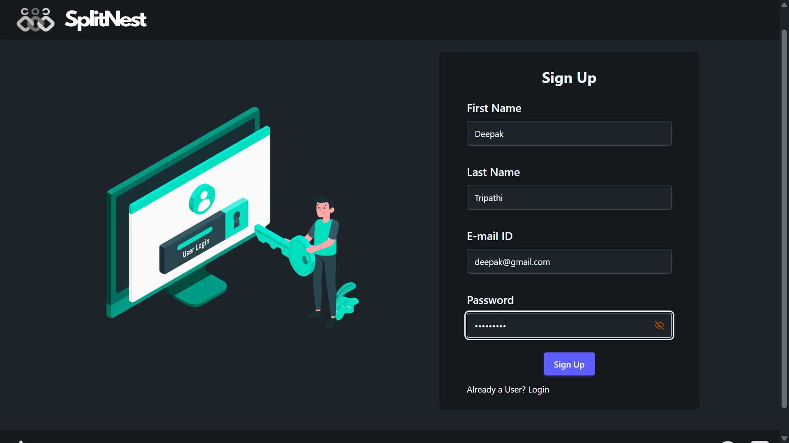
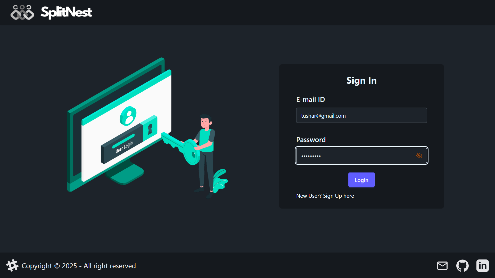
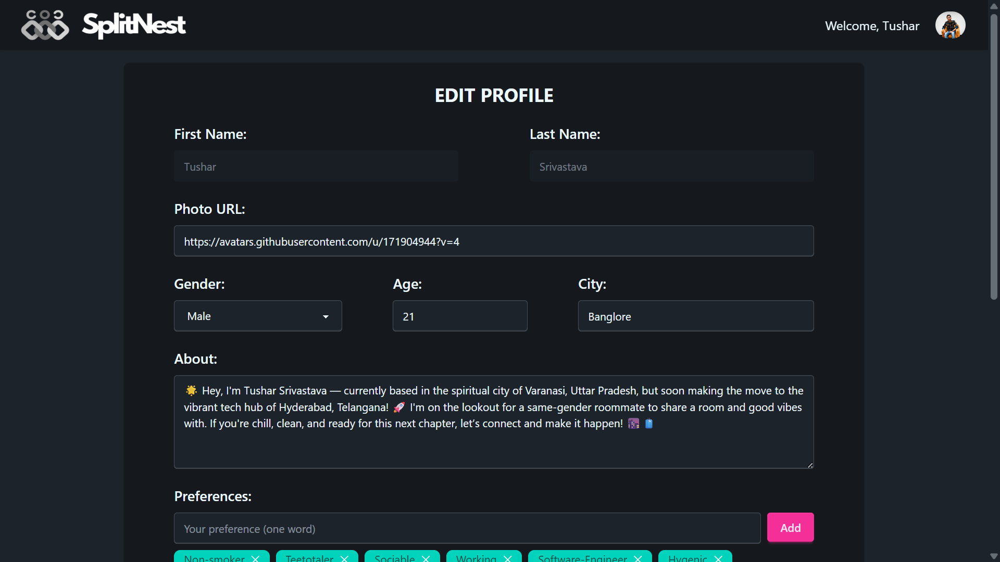
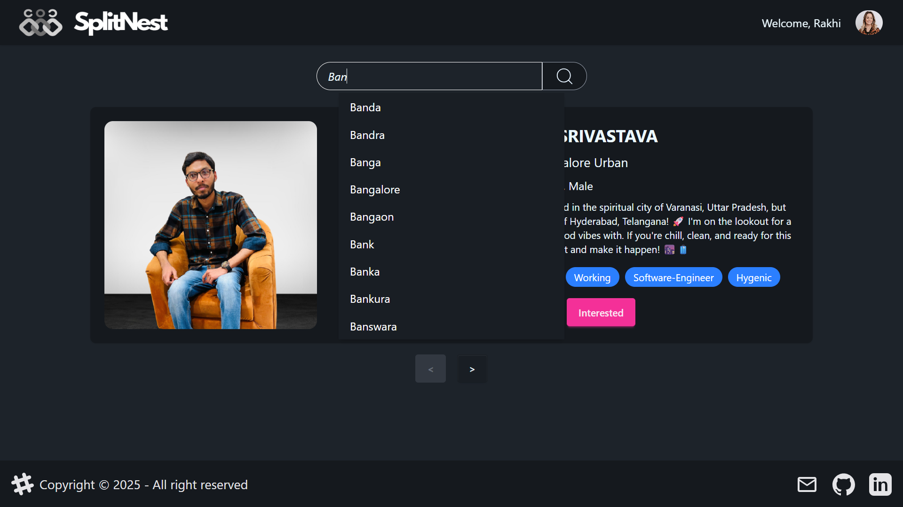
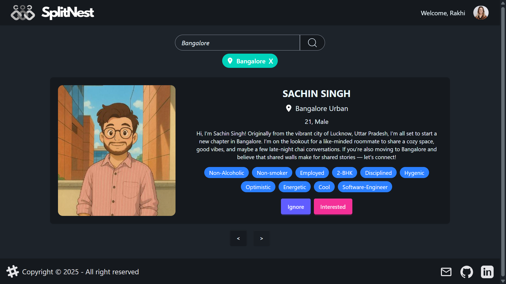
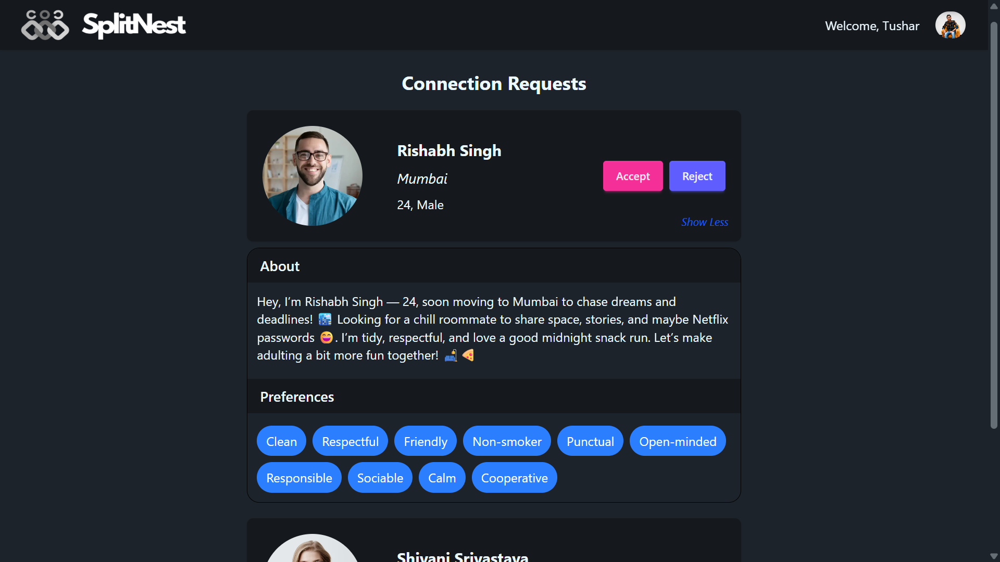
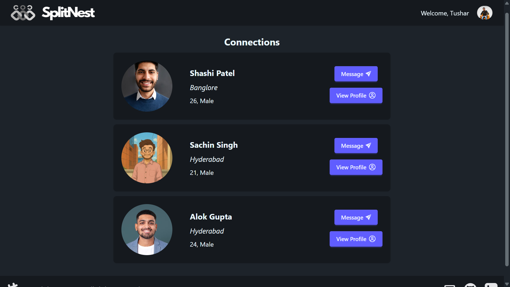
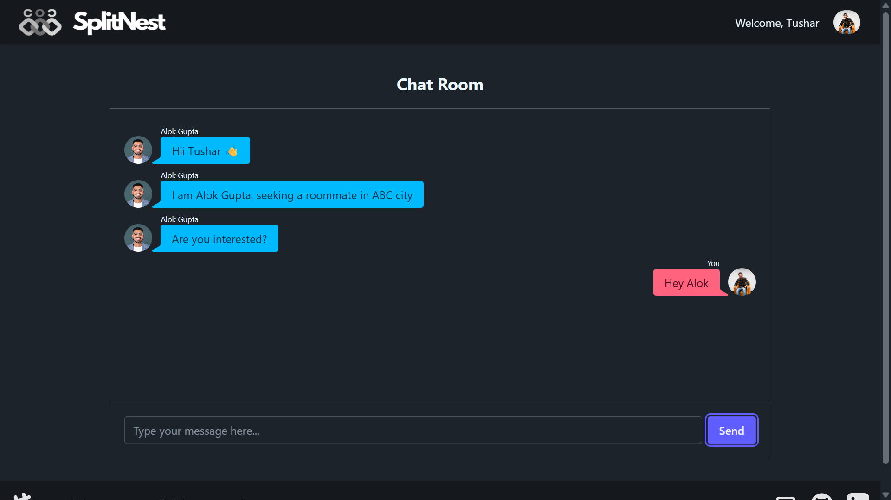
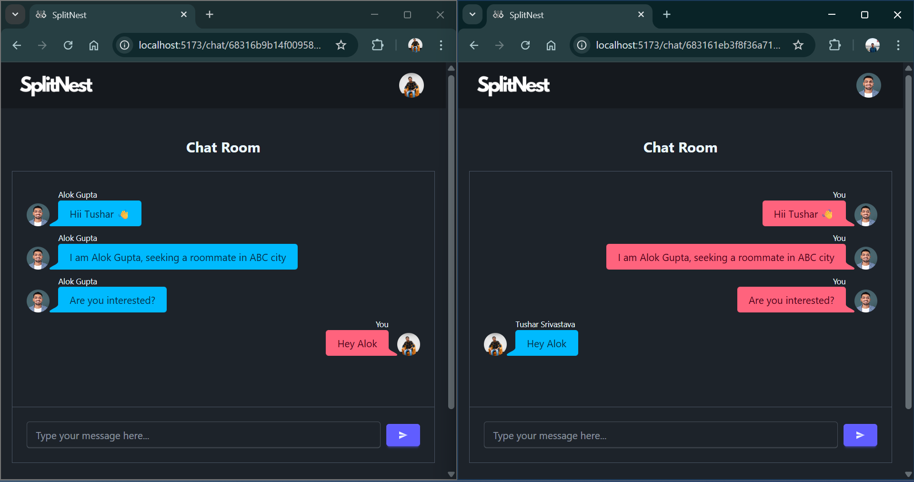
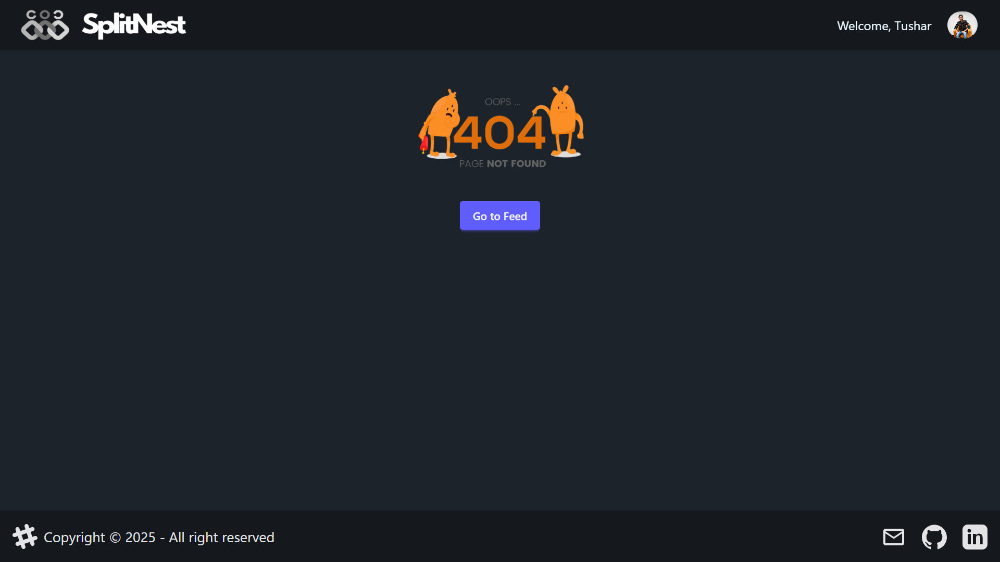

# ShareNest 🏠

**ShareNest** is a comprehensive roommate-finding web application designed to help people—especially recent graduates—find compatible flatmates that match their preferences, location, and lifestyle. Moving to a new city is challenging, and finding the right person to share a space with shouldn't add to the stress.

<p align="center">
  
  
  
  
</p>

---

## 📚 Table of Contents

- [🔥 Core Idea & Inspiration](#-core-idea--inspiration)
- [🛠️ Tech Stack](#️-tech-stack)
- [🌐Live Demo](#-live-demo)
- [✨ Features Implemented](#-features-implemented)
- [📸 Screenshots](#-screenshots)
- [💡 How to Use](#-how-to-use)
- [🔧 Installation & Setup](#-installation--setup)
- [🌱 Future Updates](#-future-updates)
- [👤 Author & Contact](#-author--contact)

---

## 🔥 Core Idea & Inspiration

When students graduate and move to new cities for jobs or higher education, finding a compatible flatmate becomes a crucial but often stressful task. Traditional methods like social media posts or classified ads often lack the depth needed to find truly compatible roommates. **ShareNest** bridges this gap by providing a comprehensive platform where users can:

- Create detailed profiles with preferences and lifestyle choices
- Discover potential flatmates through their feed section
- Build connections through a secure request system
- Communicate seamlessly with matched roommates
- Make informed decisions based on comprehensive profiles
- Filter profiles of the location where you are moving to

---

## 🛠️ Tech Stack

### 🔹 Frontend
- **React.js** - Component-based UI library
- **Tailwind CSS** - Utility-first CSS framework
- **DaisyUI** - Tailwind CSS component library
- **React Router** - Client-side routing
- **ReduxToolkit** - Global state management
- **Socket.io Client** - Real-time communication
- **Axios** - Making API calls to the backend

### 🔹 Backend
- **Node.js** - JavaScript runtime environment
- **Express.js** - Web application framework
- **MongoDB** - NoSQL database
- **Mongoose** - MongoDB object modeling
- **bcrypt.js** - Secure password hashing
- **JWT** - JSON Web Tokens for authentication
- **Cookie-Parser** - Session management
- **Socket.io** - Real-time bidirectional communication
- **CORS** - Handling cross-origin requests

---

## 🚀 Live Demo

🌐 [Visit ShareNest Live](https://share-nest-zeta.vercel.app/)

---

## ✨ Features Implemented

### 🔐 Authentication & Security
- **Secure Registration** - Create account with email and password.
- **Login/Logout** - JWT-based authentication with cookie sessions
- **Password Security** - bcrypt hashing for secure password storage
- **Session Management** - Persistent login sessions with secure cookies

### 👤 User Profile Management
- **Comprehensive Profiles** - Add personal details, preferences, and lifestyle choices
- **Profile Editing** - Update information anytime
- **Profile Viewing** - Browse detailed profiles of potential roommates

### 🤝 Connection System
- **Connection Requests** - Send interested/ignore requests to potential roommates
- **Request Management** - Accept or reject incoming connection requests
- **Connections Dashboard** - View all your established connections

### ✅ Feed System
- **Smart User Suggestions**: Displays a curated list of new users you haven't interacted with—no existing connections or pending requests.
- **Pagination UI**: Built with pagination to ensure smooth navigation and optimal performance for large datasets.
- **City-Based Filtering**: Easily filter profiles based on city names.
- **Autocomplete with Debouncing**: Enhances the user experience with city name suggestions as you type, using debouncing to reduce unnecessary API calls and improve performance.

### 💬 Real-time Chat
- **Instant Messaging** - Chat with connected roommates in real-time
- **Socket.io Integration** - Seamless, fast communication
- **Message History** - Persistent chat history
- **Secure chat** - Allows chat between mutual connections only


### 📱 User Experience

- **Responsive Design** - Works perfectly on desktop, tablet, and mobile
- **Intuitive Interface** - Clean, modern UI with DaisyUI components
- **Fast Navigation** - Smooth routing with React Router
- **Global State Management** - Efficient state handling with Redux

---

## 📸 Screenshots

### **Sign Up Page**

### **Login Page**

### **Edit Profile Page**

### **Feed Page**

### **City Autocomplete in Feed**

### **Filter Profiles by city**

### **Connection Requests Page**

### **Connections Page**

### **Chatting Page**

### **Responsive Design**

### **Page Not Found**


---

## 💡 How to Use

### Getting Started

1. **Signup** for new account with email and password
2. **Complete Profile** by adding your details, preferences, and lifestyle information
3. **Login** and browse the feed for potential flatmates.
4. To **Discover Roommates** browse through your feed.
5. Apply **City Filter** to find roommates in specific city.
5. **Send connection requests** to people you're interested in.
6. **Accept or reject** requests received.
7. **Start chatting** with people you’re connected with to explore compatibility further.


### Finding the Perfect Roommate

1. **Set Preferences** - Specify your location, budget, and lifestyle preferences
2. **Browse Profiles** - View detailed profiles of potential roommates
3. **Make Connections** - Send connection requests to interesting profiles
4. **Chat & Connect** - Use the built-in chat to get to know your matches
5. **Meet in Person** - Arrange to meet your top matches in person

---

## 🔧 Installation & Setup

### 0. Prerequisites

- Node.js
- MongoDB database
- Git

### Backend Setup

#### 1. Clone the Repository

```bash
git clone https://github.com/official-tushar/ShareNest.git
cd ShareNest
```
#### 2. Install Backend Dependencies

```bash
cd server
npm install
```

#### 3. Configure Environment Variables
Create a .env file in the /server directory:

```bash
PORT=7777
MONGO_URI=your_mongodb_connection_string
JWT_SECRET=your_jwt_secret_key
```

#### 4. Start the Backend Server
```bash
npm run dev
```

### Frontend Setup

#### 1. Navigate to Frontend Directory
```bash
cd client
```

#### 2. Install Frontend Dependencies
```bash
npm install
```

#### 3. Configure Environment Variables
Create a .env file in the /client directory:

```bash
VITE_BACKEND_URL=your_backend_url
```

#### 4. Start the Frontend Development Server
```bash
npm run dev
```

### Note
Ensure your MongoDB instance is running

---

## 🌱 Future Updates
- Advanced Matching Algorithm - AI-powered compatibility scoring
- Video Calling - Integrate video chat for virtual meetings
- Property Integration - Connect with real estate listings
- Reviews & Ratings - User feedback system for better trust
- Advanced Filters - More granular search and filtering options
- Group Chats - Multi-user chat rooms for shared housing
- Enhanced Security - Add two-factor authentication


---

## 👤 Author & Contact
**Developer Information**:
Tushar Srivastava

- **GitHub**: @official-tushar
- **LinkedIn**: tusharsrivastava8404
- **Email**: tusharsrivastava8404@gmail.com
